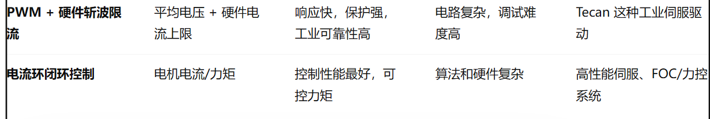
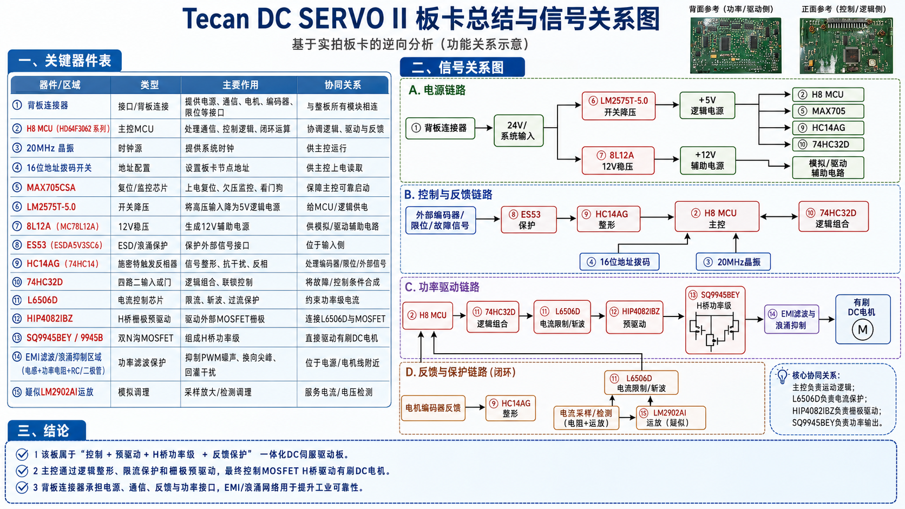

### `Tecan DC SERVO II(power)` 逆向

---

第一阶段：搞懂原板接口和控制逻辑
第二阶段：用 STM32 / 自研驱动板复现功能

---


DC SERVO II 和 DC SERVO II POWER 几乎完全一样，就是限流大小有点区别；


---

电路板：


STM32 确实内置复位、欠压检测和看门狗功能；
但工业电机驱动板通常还会加外部 MAX705，
目的是让电源监控和程序失控保护独立于 MCU 本身，
提高安全性和可靠性。


 **十六进制旋转拨码开关**   它输出的是数字编码，一般有 `0~9、A~F` 共 16 个档位   -----------   用来区分板卡地址；

主控通过背板总线和它们通信时，需要区分：

```
哪一块板
哪一组轴
哪一个伺服节点
```


8L12A   ---- 12V LDO    24伏转12伏


HC14AG  ---- 数字信号整形芯片:  施密特触发反相器

```
把有毛刺、边沿慢、受干扰的信号
        ↓
变成干净的 0/1 数字信号
```


大电阻区域可能是：

```
H 桥 / 电机驱动芯片
        ↓
磁环电感
        ↓
RC / RLC 吸收网络
        ↓
背板连接器
        ↓
有刷 DC 电机
```


L6505D

```
H8 MCU
  ↓ 控制信号 / 目标电流
L6506D
  ↓ 斩波/限流控制
HIP4082IBZ
  ↓ 栅极驱动
9945B / 外部 MOSFET
  ↓
有刷 DC 电机
  ↑
采样电阻反馈电流
```


| 芯片        | 类型             | 核心作用               | 在电机板上的意义                  |
| ----------- | ---------------- | ---------------------- | --------------------------------- |
| **HC14AG**  | 施密特触发反相器 | 信号整形、反相、抗干扰 | **把脏信号变成干净 0/1**          |
| **74HC32D** | 四路 OR 门       | 逻辑合并               | 把多个条件组合成一个控制/保护信号 |


//底层直接电流控制   


```
H8 MCU / 主控逻辑
        ↓
HC14AG 信号整形
        ↓
74HC32D 逻辑组合
        ↓
L6506D 电流限制 / 斩波控制
        ↓
HIP4082IBZ H桥预驱动
        ↓
SQ9945BEY MOSFET H桥
        ↓
有刷 DC 电机
        ↑
电流采样 / 编码器反馈
```


L6506D作用：

```
电机电流
   ↓
采样电阻 Rsense
   ↓
产生采样电压 Vsense
   ↓
L6506D 比较 Vsense 和 Vref
   ↓
电流没超限：允许 H 桥继续输出
电流超限：触发斩波/关断
```


> 
>
> 这个硬件斩波限流和电流环还是有点区别；


LM2575T 5.0  ----  背板   BUCK  24降压成5V


---



